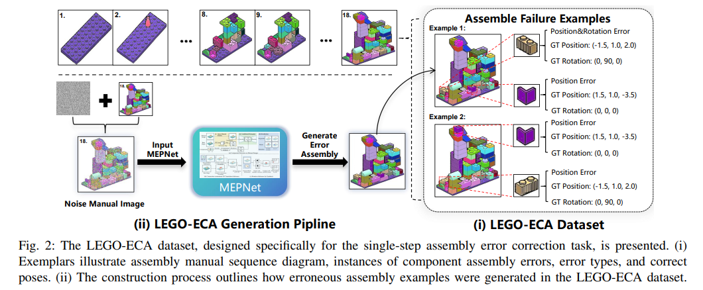
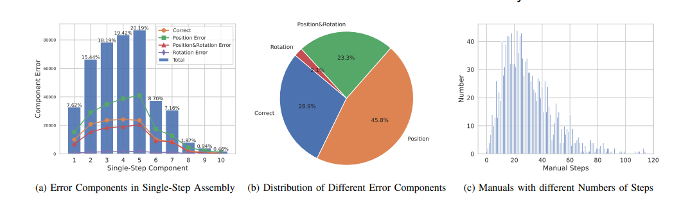

# SCANet

This is the repository that contains source code for the [SCANet website](http://github.com/Yaser-wyx/SCANet).

## LEGO-ECA dataset
This dataset which is based on the [Synthetic LEGO Dataset](https://arxiv.org/abs/2207.12572 "Translating a Visual LEGO Manual to a Machine-Executable Plan. ECCV, 2022") comprises 1,429 LEGO assembly manuals, each containing 2D illustrations of each assembly step along with various possible assembly failure scenarios.

To construct the LEGO-ECA dataset, we randomly selected 1,429 assembly manuals from the training set of the Synthetic LEGO Dataset. Subsequently, we inputted each step into MEPNet for component assembly. To simulate incorrect assembly samples more effectively and consistently, we preprocessed the manual images before inputting them into MEPNet. This involved adding random Gaussian noise to interfere with the assembly process, thereby inducing MEPNet to output incorrectly assembled examples. For each assembly step, we applied 3 to 5 random Gaussian noise injections. Ultimately, we constructed a dataset containing approximately 120,000 instances of incorrectly assembled examples. We conducted statistical analysis on the LEGO-ECA dataset. 



From proportions of different types of incorrectly assembled components in single-step assembly, we can know that in single-step assembly, involving typically 2 to 5 components, positional errors are the most prevalent. Rotational errors frequently accompany positional misalignment and tend to occur concurrently with positional errors, resulting in fewer instances of isolated rotational errors. From distribution of different types of incorrectly assembled components across the entire dataset, we can get that positional errors are predominant, while rotational errors are the least frequent. Correct components and those with both positional and rotational errors roughly occupy similar proportions. Besides, the majority of manuals have step counts ranging from 15 to 40.



To get more details, you can check: https://drive.google.com/file/d/1gbLhaOiUsnfuYrKHe5TAd3IlUteya267/view?usp=drive_link.

If you find SCANet useful for your work please cite:
```
@article{wan2024SCANet
  author    = {Yuxuan Wan, Kaichen Zhou, Jinhong Chen ,Hao Dong},
  title     = {SCANet: Correcting LEGO Assembly Errors with Self-Correct Assembly Network},
  journal   = {IROS},
  year      = {2024},
}
```

# Website License
<a rel="license" href="http://creativecommons.org/licenses/by-sa/4.0/"></a><br />This work is licensed under a <a rel="license" href="http://creativecommons.org/licenses/by-sa/4.0/">Creative Commons Attribution-ShareAlike 4.0 International License</a>.
